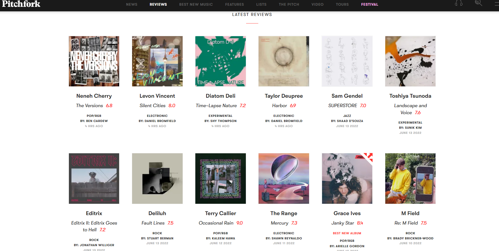

# Show score on pitchfork
a tamermonkey script for pitchfork, which can show all the scores on the albums list page when you scrolling instead of  in every review page, therefore you don't need to  click and check every album url anymore.

# Installation

1. Install Tampermonkey
 [(Tampermonkey link)](https://chrome.google.com/webstore/detail/tampermonkey/dhdgffkkebhmkfjojejmpbldmpobfkfo?hl=en)

2. Either you can just click the 'INSTALL' link below or you can install it from greasyfork
[(GreasyFork link)]()

3. - [INSTALL]()

4. Viola!

# ScreenShot

## If you have a bug or an idea, feel free to create an issue:grinning:! 
## If you like it, you can give me a star:star:!
